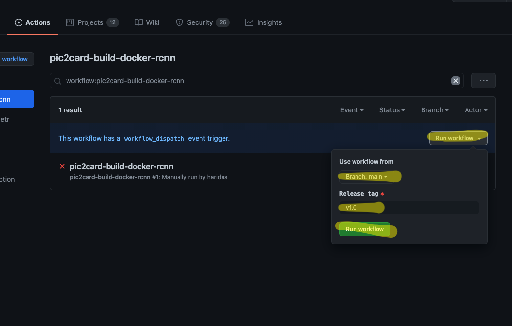

Title: Packaging Object Detection Models for Production
Date: 2021-01-16  00:00
Category: data-science
Tags: pytorch,tensorflow,docker
Authors: Haridas N


Recently I got the chance to be part of an open-source project effort from our 
[company](https://imaginea.com) named pic2card. There we are mainly exploiting
the object detection models for this problem. Object Detection models have become
one of the mainstream in the ML world, a lot of innovative models came into existence
in recent years. Currently, most of the models are trying to reduce the latency by
keeping the quality of the existing model, so that these can be applied for videos
and real-time video streams.

If you consider the different models available for object detection you can see
a lot of implementations available for the key architectures in Tensorflow and PyTorch.
These object detection models mainly use a benchmark dataset named
[MS-COCO](https://cocodataset.org/), similar to the [ImageNet](http://image-net.org/)
dataset for the Image classification competition.

So if you are using an object detection model to solve one of your problems, how you
manage the different model options at your hand, end-to-end how you design the pipeline
and build and ship your project into production. Here I’m trying to show a quick walkthrough
of how we attacked this problem for the pic2card project.

Key things to concentrate on are,

1. Model specific dependency management.
2. The flexible way to package and ship your service with different model implementations.
3. Docker packaging.
4. Deploy the ML service into a Serverless environment.

Your project structure and modularisation heavily influenced by the downstream pipeline
requirements like the one listed above. Let’s look into each one of them briefly.

#### Dependency Management

1. Common dependencies for your ml service and preprocessing pipeline in the `requirements.txt` file
2. Model specific dependency in corresponding requirements files. for eg; `requirements-tensorflow.txt`, or `requirements-pytorch.txt`

```bash
# Common dependencies are kept here
$ cat requirements.txt
numpy==1.9.2
flask==1.1.1
...

# Only Tensorflow specific packages
$ cat requirements-tensorflow.txt
tensorflow==1.15.4

# Only Pytorch specific packages.
$ cat requirements-pytorch.txt
torch==1.5.0
torchvision==0.6.0
```

Keeping separate requirements has to be in sync with how you structure the code so that
the code path that requires `PyTorch` won't get loaded while using the `tensorflow` models
for inference. With Python, it's easy due to the dynamic nature of the language, with
static languages it has to be done by a common interface implementation and separate library packaging.

#### Packaging using Docker

Now let's see how to build the Dockerfile for your ML Service and how we can include
the trained model with your ML Service.

Dedicated Dockerfile for each type of pipeline provided they have options to change
the pipeline properties at image build time itself. Make use of the Multi-stage dockerfiles,
which helps to accommodate different configurations that we need to bake into the docker image build time. eg;

1. Build a Docker image with an embedded tensorflow model and CPU/GPU support
2. Build a Docker image without model embedded init, instead configure the service to reach out for the ML APIs
3. Build a Docker image with Pytorch version of the model embedded
4. Build a Docker image with an embedded C++ (libtorch) model inference pipeline.

#### ML Service with TF model

```bash
# Global ARGs
ARG TARGET_API=frozen_graph

## Stage 1: TFS base stage
FROM python:3.7.9-slim-buster as tfs
ADD requirements/requirements.txt /app/requirements.txt

## Stage 2: Embedded model with service stage.
FROM python:3.7.9-slim-buster as frozen_graph
# Fill in both, as in this case, we need both dependencies.
ADD requirements/requirements-frozen_graph.txt /app/
ADD requirements/requirements.txt /app/
RUN cat /app/requirements-frozen_graph.txt >> /app/requirements.txt
COPY model/frozen_inference_graph.pb /app/model/

## Stage 3: Temp stage to keep project files
FROM $TARGET_API AS build
COPY app /app/app
COPY mystique /app/mystique

## Stage 4: Main Docker Image
FROM python:3.7.9-slim-buster

# Life-saving option to know which version of code got packaged in this
# docker image!
ARG COMMIT_SHA=
ARG BRANCH_NAME=

# Having separate ARG variable as global one is not accessible
# under one FROM block.
ARG tfs_enable=

# Use this ENV to control the code path in your service.
ENV ENABLE_TF_SERVING=$tfs_enable

### < Dependencies and projects in place, now goes install dependency and other setups. > ###

```

Here only showing the key parts of this setup. If you want to see how this has been
done for the pic2card project please refer [here](https://github.com/microsoft/AdaptiveCards/blob/main/source/pic2card/docker/Dockerfile).

For the `PyTorch` other framework based models you can follow a similar pattern of
build pipeline and accordingly modularise the packages for better management of your
entire pipeline. If you want to see the PyTorch example, please check this [repository](https://github.com/microsoft/AdaptiveCards/blob/main/source/pic2card/docker/Dockerfile-detr).

### CICD using Github Actions

This would be an Icing on the cake feature for you, This helps to avoid all the
headache of setting up a CICD pipeline and manage those.  So Actions help to make
the end-to-end pipeline works well, and error free and it's less stressful for the entire team.

Another cool feature is you can build your project and push the docker image to GitHub provided docker registry itself.

See the pipeline setup that we have done for the pic2card project - [https://github.com/microsoft/AdaptiveCards/tree/main/.github/workflows](https://github.com/microsoft/AdaptiveCards/tree/main/.github/workflows)



### Github Docker Registry

This is another feature we get for free from GitHub; this avoids the worry of
where to keep the docker images and you don't need to manage docker registry servers for yourself.
You can build the images using GitHub actions and keep them under the GitHub docker registry.
This makes life easier to build and keep the publically available images for anybody to deploy or try out.

Try this out here
[https://github.com/features/packages](https://github.com/features/packages)


### Deployment on serverless environments

If you are already into AWS or other cloud providers to provision your infrastructure
then it’s much easier to deploy your ready to run docker image into serverless options
provided by these cloud providers. Eg; [Azure Functions](https://docs.microsoft.com/en-us/azure/azure-functions/functions-create-function-linux-custom-image?tabs=bash%2Cportal&pivots=programming-language-csharp)
or [AWS Lambdas](https://aws.amazon.com/blogs/aws/new-for-aws-lambda-container-image-support/),
both these providers support serverless option with docker so that you can easily deploy it
without having to package it in some other cloud provider specific packaging of your project ( eg; zip or others ).

> As mentioned above one thing to be aware of is ensure your image size is not too large,
in our case it comes close to 1GB for the ML service image with a model embedded in it.

### Takeaway

The key takeaway I can give if you are planning to package your ML based services are,

1. Don't keep any unnecessary dependencies
2. Ensure your service running on GPU/CPU, and include packages specifically for those targets, and save the image size. In general, CPU Model inference is enough.
3. Structure your service code with these modularisations in mind, so that using Environment variables you can switch the code paths.
4. Keep models from different frameworks like TensorFlow / PyTorch / others separate, ensuring your code doesn’t need to be touched for this purpose.
5. Reduce the Docker Image so that the service can be deployed in a serverless environment in a better way.