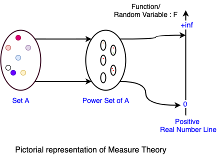
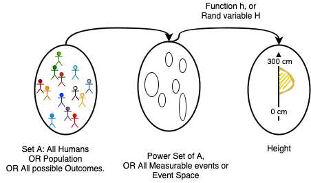

Title: What's Random Variable
Date: 2020-12-08  00:00
Category: data-science
Tags: statistics,probability
Authors: Haridas N

This is one of the basic ideas that are commonly not understood properly, we learn
this from the high school level. Currently, most of the exploration is going
back to basics and wondering why they are defined like that. I can see that most of the
definitions have mathematical backgrounds and general theorems or axioms
present, which I'm trying to understand more now. Here I want to see what’s
the intuition behind the Random Variables.

> **From Wikipedia:**
>
> A Random variable / Random Quantity/ Stochastic Variable is
> described as a variable whose value depends on the outcomes of a random phenomenon.

Definition based on Measure Theory is more intuitive,

> Random Variable isn't a variable, it's a function which maps objects to real valued line.

The definition of a Random variable in Formal Mathematical term is defined using
Measure Theory, It seems measure theory based intuitions are easier to connect
rather than statements which define the random variable. Usually, we remember
things if we can associate them with some real-world entities or actions, which
is more intuitively we can recollect when we want to restate or understand other
similar concepts. I’m trying to wrap around this basic idea using measure
theory.

## Measure Theory

Very generically we can say, Measure can be explained using the Set Theory from
the Wikipedia article is very apt here.

> **Measure on a Set is a systematic way to assign a real number to each suitable subset of a set.**

**Measurable Events:** We can group those set of events that can be measured or quantified by using some units that we are familiar with.

Here `Set A` can be anything ( eg; all people in the world, space in physics, number of atoms in the universe ), that we are trying to understand. Power Set of `Set A` includes all elements in `Set A` as well as all combinations of items in `Set A` including the `null` item.

Assigning a real number to all these subsets of A is called **Measuring**. We can do any type of measuring activity that is possible on the `Set A` or the measuring that's important to us. For example, to understand the heights of all humans in the globe, we do Measure their height, here the measuring is finding the height of each and every person and map that to a real line with some unit.

I was wondering, why the Measure was defined like this, why the intermediate set ( power set of `A` ) required here ?, why note map the initial set A to the real number? What I'm able to reason here for these questions are,

1. Power set includes the `set A` also
2. It takes care of the cases where the original set is not fully tractable or impossible to find all the items in it, so we have to measure things that are available for us, so there the subset makes sense as a framework.
3. In the case of non-discrete space eg; length, volume, temperature, etc, it's impossible to get the exact value, hence ranges are used or subsets here.

### σ-algebra ( Sigma Algebra )

An `Algebra` on a Set is a collection of subsets closed under Union and Intersections.

An `σ-Algebra` on a Set is a collection of subsets closed under countable unions and Intersections.

What's mean by **closed** is that, if we take any two items from the given set and we do the specified operation (union or intersection), the result also available in the same Set.

The `Countable` union or intersection means, we can associate natural numbers to the subsets of a given set, ie; a bijective nature in the mapping. Another side of it is, all the subsets are not measurable, as it wouldn't follow the constraints of σ-algebra, Hence σ-algebra is a special constraint applied on a Set to define the Measure and Measure space.

 [Source: Wikipedia] 

Note: Here $\mu$ is a **Measure**.

### Different Types of Measures

Based on some constraints applied on how we can do the measuring or what to measure we can group the Measuring to different types of measures that are common for a particular domain,

1. **Borel Measure**: Allocate real number to space.
2. **Lebesgue Measure**: Standard way to measure the n-dimensional euclidean space. This measure is a more general one and used to formalize the probability space also. As in that case, the measure assigns values in the range of [0, 1].
3. **Counting Measure**: Counts the number of items in a subset of `Set A`
4. etc.

### Measure Space

Measure space is defined using a triplet - $(X, A, \mu)$, Here

1. $X$ is the Set
2. $A$ $\sigma$-algebra defined on the Set X, or the subset follows the constraints of $\sigma$-algebra.
3. $\mu$ is the measure

This abstract notion helps to understand the entire Measure space and its characteristics.

1. **Euclidian space** - Try to measure the Length, Area, Volume, hypervolume, etc. Or more common 3-D space.
2. **Probability Space** - In this case, the Measure of an entire Set is 1. And `null` set gets value zero -- We can say this space is an abstract space, with some special properties attached to it. This is being done by proper normalization or knowing about all subsets in the measure space.
3. etc.

Probability Space also formally defined by the triplet same as above, but the elements are named differently, as,

Probability space triplet - $(\Omega, F, P)$

1. $\Omega$ - All possible outcomes of an experiment or `Sample Space`,
2. $F$ - Subsets of $\Omega$ called as `Event Space`, each subset is called an `event`. We can call the $F$ set of all events from sample space.
3. $P$ - Probability function, which assigns a real number between [0-1] to every  `event`.

Here you will be wondering how the probability function ensures the mapping is between 0-1 ?, this is being ensured by the proper normalization factor, if the sample space $\Omega$ is fully tractable, then that can be used, or only approximation works there.

Why $P(\Omega) = 1$, this can be explained by applying the rule of $\sigma$-algebra, the functions should support, **countable union**,

$P(\Omega) = P(O_1) + P(O_2) + ... + P(O_n) = 1$

## Random Variable

Now we all already covered what's Random variable multiple times above, let’s restate it here,

> **A random variable is not a variable but a function that maps from space to the real number domain.** So we can see that Random Variable is a measure done on a specified Measure Space.

So it's clear that we can pick, any measurable function as a random variable. Few constraints applied there are

1. Whether that measurable function is usable to us.
2. We can do the measure on the given Space.

If we are dealing with the probabilities of outcomes of an event, then we can represent this entire experiment using the `probability space` definition.

##### Q: So what's **Random** in Random Variable?

A: Only thing here random being important is, at measure time we shouldn't be biased on any specific type of subsets for measuring. So the **process** of measuring has randomness, hence we call this a random variable.

Let's take one example experiment, where we consider all humans as our **Measure Space**

## Probability Distributions

> From Wikipedia, Probability Distribution is a mathematical description ( or summary) of probabilities of events, subsets of the sample space. These descriptions are represented as a function.
>
> Putting it in another way: Probability Distribution is a function that gives probabilities of occurrence of different possible outcomes for an Experiment.

IMO, This idea came because, after seeing different probability spaces ( or outcomes of different experiments ) we were observed surprisingly have a common pattern. From this, we have an abstract meta function that describes the behaviors of a **random variable**.

The Normal Distribution ( Bell curve ), seems to be a common pattern we see for a lot of Random Variables that we pick, If a particular Random Variable follows a pattern of particular distribution, then we call it as normally distributed Random Variable. There are a lot of different types of distributions present based on the different characteristics of the Random Variable. In which the Normal Distribution seems to be a universal standard behavior across the board.

There are two key principles around this,

Let's explain this using a simple measure experiment - **Measure height of people across the globe**

The measuring process is shown below, 

It's not humanly possible to measure all 7+ Billion people's height to get an idea about how it distributed. So this will be done by taking samples randomly from different locations, and repeat this process till we feel the measure is consistent enough or showing convergence properties. ie; the overall properties of the measure ( probability distribution ) isn't changing considerably after N ( finite sample ) measures.

#### 1. Central Limit Theory ( CLT )

> An **Average** of Random Variable's distribution tend towards Normal Distribution ( Bell curve ) if we do measure/sample an infinite number of times.

This observation comes empirically. The averaging operation actually bringing the distributions of different independent and identically distributed (i.i.d.) random variables centered around the global average or Population Average. This is where the CLT has some relation to the Law of Large Number discussed below, which covers the Expected Value of a Random Variable will be stabilized when we sample/measure enough number of time from the event space.

#### 2. Law of Large Number

> Sample Mean converges to the population mean.
>
> Sample Mean is the set of events we have measured ie; Random Variables.

In the above measure of height, we can consider there is an unknown population mean $\mu$ and population standard deviation $\sigma$. We are doing this measure to find this population mean and variance or other properties of the height ($H$) random variable. So from the event space, we randomly pick N number of people and measure the height, ( N maybe 1000, or 1Million or so ).

I have discussed the Law of Large Number in another blog post also - [Expected Value of a Lottery](https://haridas.in/expected-value-of-lottery-ticket.html)

Thanks for reading. If you have any suggestions, please comment or contact me via Twitter `@haridas_n`

## References

1. https://nrich.maths.org/13852
2. https://en.wikipedia.org/wiki/Probability_axioms
3. https://en.wikipedia.org/wiki/Probability_theory
4. https://en.wikipedia.org/wiki/Random_variable
